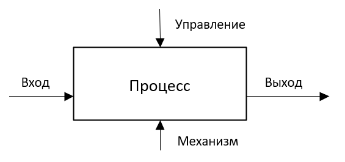
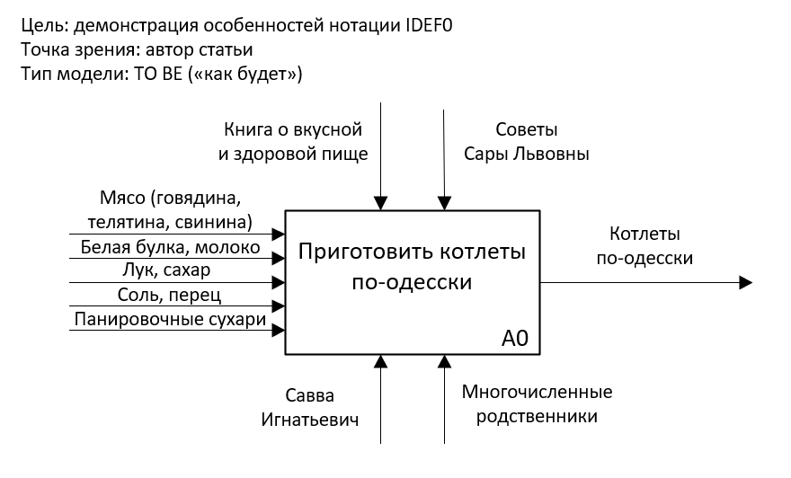
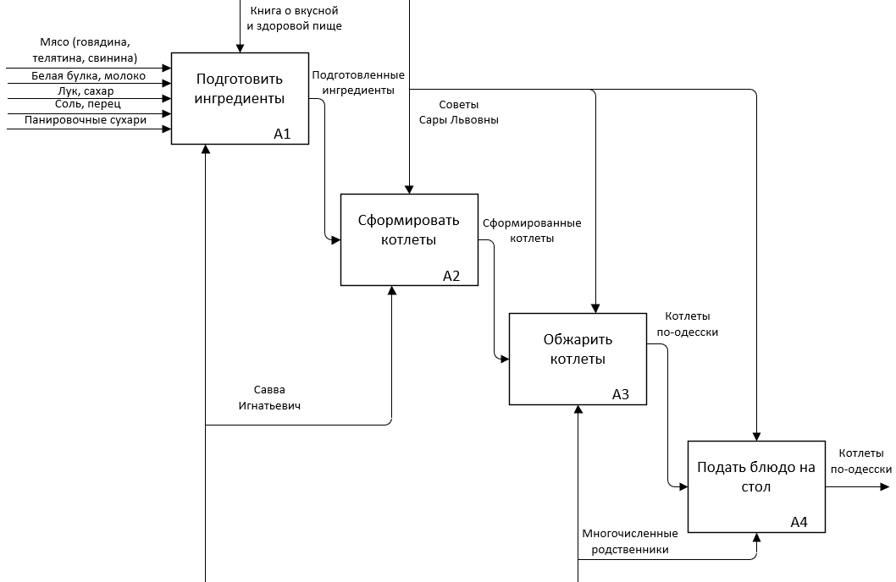
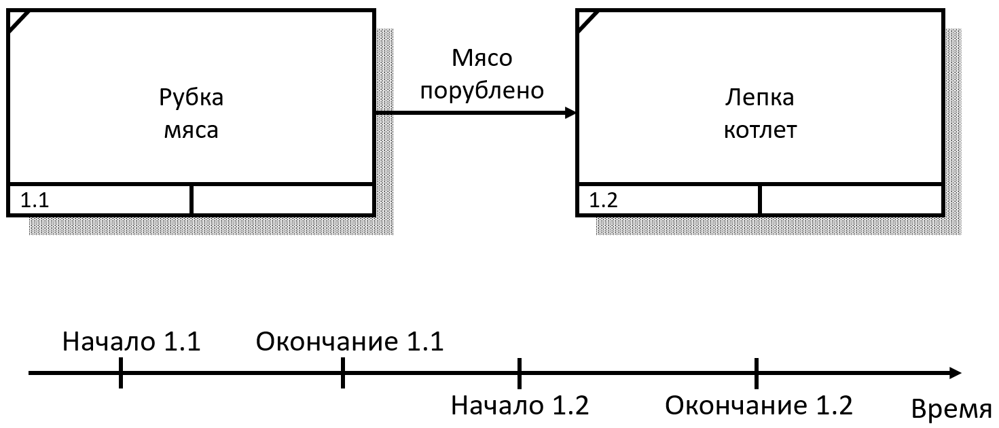
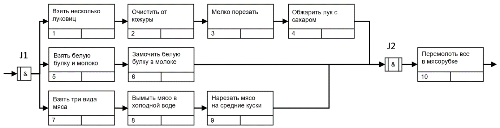

# Нотации моделирования бизнес-процессов

## 1.1 Для чего предназначены IDEF0 и IDEF3, их отличия

*IDEF0* -- это методология функционального моделирования и графическая нотация, используемая для создания функциональной модели,
отражающей структуру и функции системы, а также потоки информации и материальных объектов, связывающих эти функции

### Описание в нотации
1. Функциональный блок -- отображает функцию (действие или работу)
2. Стрелки -- отображают взаимодействие с внешним миром и между собой (указывают, какие ресурсы, правила получает на входе или передает на выходе блок)

### Визуальное представление процесса
#### Четыре базиса нотации:
- использование контекстной диаграммы
- использование 5 типов стрелок
  - ввод процесса, операции, действия или функции (сырье, комплектующие, расходные материалы, финансы и тд -- все, что будет преобразовано в ходе выполнения процесса)
  - вывод процесса, операции, действия или функции (преобразованная информация, товарно-материальные ценности, отчетность, продукция или услуга)
  - механизм (сотрудники, техника, оборудование, ПО, т.е все, что участвует в процессе). Всегда направлен снизу извне
  - контроль (стандарты, акты, инструкции и тд). Определяет как должен выполняться бизнес-процесс. Всегда сверху
  - вызов -- обращение из одного блока к другому. Всегда присоединяется снизу, направляется из функционального блока и помечается ссылкой на вызываемый блок.
- поддержка декомпозиции
- доминирование. Степень важности или хронологический порядок. (блоки располагаются по диагонали от левого верхнего угла до правого нижнего в порядке присвоенных номеров)

Контекстная диаграмма -- общая схема и ее взаимодействия (черный ящик). Основная цель -- выявление первостепенной, главной задачи.
Показывает, какую бизнес-цель мы преследуем, какие ресурсы используются при этом и что будет получено на выходе исполнения процесса, кто будет задействован, чем будет регламинтирован процесс

Детализированная диаграмма -- углубляется в каждую функцию, описывая конкретные шаги, действия и взаимодействия.

Можно еще глубже декомпозировать блоки, которые выглядят, как "черный ящик". пример -- "подготовить ингридиенты"

В стандарте диаграмма должна содержать от 3 до 6 блоков.

Вывод -- простота и удобство использования для описания процессов верхнего уровня. При этом диаграмма большая и тяжело читается

https://infostart.ru/pm/1408200/

*IDEF3* -- методология моделирования и стандарт документирования процессов, происходящих в системе, а также механизм сбора информации о процессах

Нотация показывает причинно-следственные связи между системами и событиями в понятной форме, используя структурный метод выражения знаний о том, как функционирует система, процесс или предприятие.

### Основные элементы
- Работы -- действия, задачи, выполненные в процессе. Описание работ
- Стрелки -- показывает направление потока работ. Показывают взаимотношения работ
  - стрелки предшествования
  - отношения
  - потоков объектов
- Ссылки -- связывают диаграммы между собой
- Узлы (перекрестки) -- используются для группировки работ и стрелок

Все вместе

https://infostart.ru/pm/1494168/

### Отличия IDEF3 от IDEF0
Нотация IDEF3 детально показывает поток работ и последовательность этапов, в то время как IDEF0 описывает процессы верхнего уровня и применяется для функционального моделирования

IDEF3 можно использовать как самостоятельную нотацию или в качестве декомпозиции для IDEF0
IDEF3 описывает сценарий и последовательность операций для каждого процесса
IDEF0 -- каждая функция представлена в виде отдельного процесса средствами IDEF3