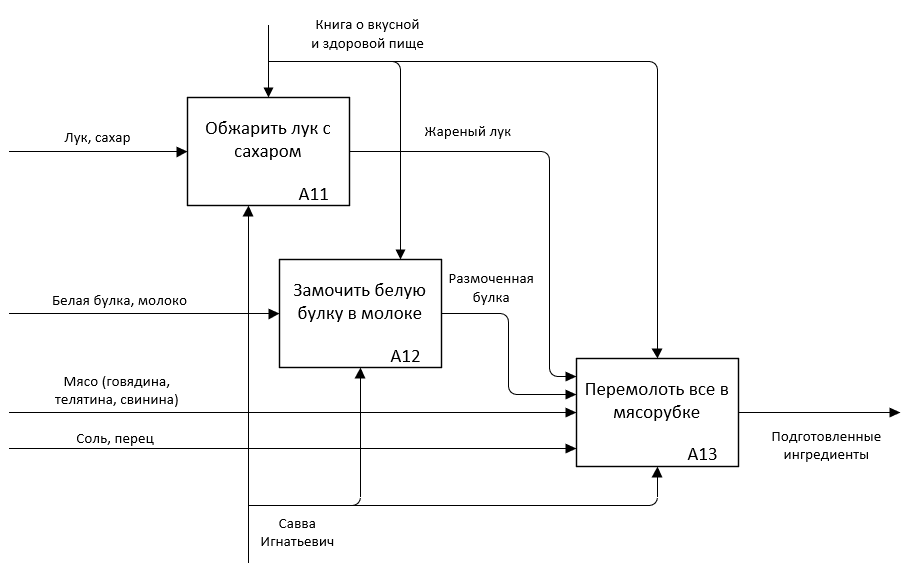

# Моделирование бизнес-процессов

## Как нумеруются функции и диаграммы в IDEF0

Если на одной диаграмме не получается детализировать все составляющие компоненты (из-за строгих ограничений на их число в пределах одного рисунка)
то создаются дополнительные диаграммы, детализирующие отдельные этапы вышестоящей схемы.

Декомпозиция продолжается до тех пор, пока не достигнем нужного уровня конкретики, достаточного для закрытия исходных целей и задач

### Разбивка на уровни получается так
- А-0 (а минус ноль) -- это схема высшего уровня, она описывает цель моделирования, а также точку зрения и область охвата (границы будущего проекта/системы)
- А0 -- первая дочерняя диаграмма, которая всегда детализирует блок схемы высшего уровня. В этой схеме нумерация блоков производится уже от единицы. Все последующие диаграммы будут иметь уникальные номера
- А1 -- дигарамма, которая рабирает первый блок диаграммы А0. далле по аналогии
- Последующие уровни -- детализируют отдельные функции вышестоящих блок схем

### Примеры
- А32 -- детализирует второй блок в диаграмме А3
- А611 -- детализирует первый блок диаграммы А61, А61 детализирует первый блок диаграммы А6. Получается матрешка.

### A-0

### A0

## A1

