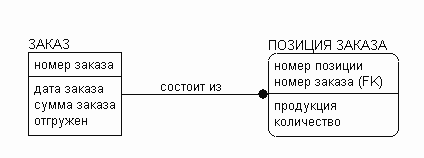
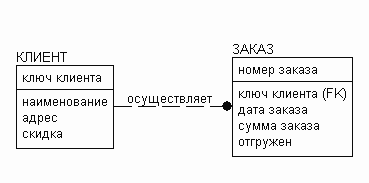
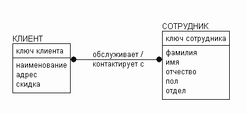
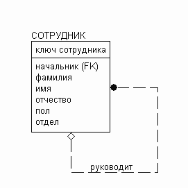
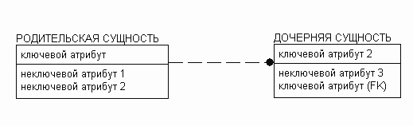
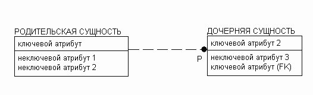
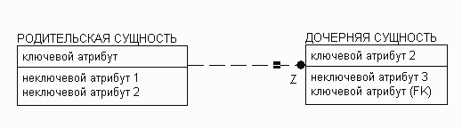
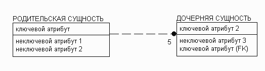

# Базы данных

## IDEF1x: типы связей между сущностями и их графическое обозначение

Сущность -- предмет, который может быть идентифицирован некоторым способом, отличающим его от других предметов. Каждая 
сущность обладает набором атрибутов. Атрибут -- отдельная характеристика сущности.

Сущность -- сотрудник, экземпляр сущности сотрудник -- Вихорьков Игорь Иванович

Связь -- это логическая ассоциация, устанавливаемая между сущностями, которая представляет бизнес-правило или ограничение.

### Виды связей и их графическое обозначение
#### Идентифицирующая связь
Указывает на то, что дочерняя сущность связи является зависимой от родительской связи

Т.е экземпляр зависимой сущности может быть определен, только если в этом экземпляре есть ссылка на экземпляр независимой сущности
Дочерняя сущности изображается прямоугольником со скругленными углами.

#### Неидентифицирующая связь
Указывает на зависимость между родительской и дочерней сущностью, при этом экземпляр дочерней сущности может быть 
однозначно идентифицирован без ссылки на экземпляр родительской сущности

#### Многие ко многим
Во многом свидетельствует о незавершенности анализа. На конечных этапах моделирования данных все связи многие-ко-многим 
преобразуются в другие. Как правило, используется две глагольные формы

#### Иерархическая
Указывает на связь сущности саму на себя

#### Иерархия категории
Смотри [Иерархия категории](../2.3/exam.md)

### Мощность связи
Это отношение, показывающее какому количеству экземпляров дочерней сущности, может соответствовать экземпляр родительской сущности

#### Экземпляру родительской сущности могут соответствовать 0, 1 или много экземпляров дочерней сущности

#### Экземпляру родительской сущности могут соответствовать 1 или много экземпляров дочерней сущности (буква P у родительской сущности)

#### Экземпляру родительской сущности могут соответствовать 0 или 1 экземпляров дочерней сущности (буква Z у родительской сущности)

#### Экземпляру родительской сущности могут соответствовать точно 5 экземпляров дочерней сущности (число 5 у родительской сущности)

https://www.interface.ru/home.asp?artId=1135