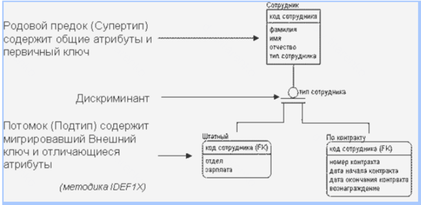
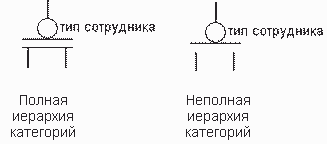

# Базы данных

## IDEF1x: что такое дискриминант и зачем он нужен, пример использования

В процессе моделирования данных выявлены сущности, часть атрибутов и связей которых одинаковы. В этом случае используется
иерархия категорий

Все общие атрибуты выделяются в сущность, называемую супертипом, а отличающиеся атрибуты помещаются в сущности-подтипы, 
связанные с супертипом.

Супертип -- сущность более общего уровня, которая объединяет несколько родственных подтипов на основе общих признаков -- 
атрибутов, связей или поведения

При помощи дискриминанта определяется, с экземпляром какого подтипа связан экземпляр супертипа.

Дискриминант -- атрибут в супертипе, который однозначно определяет, к какому подтипу принадлежит данный экземпляр.

В IDEF1x дискриминант -- это специальный атрибут супертипа (generic entity), который определяет, к какому подтипу (category entity)
относится конкретный экземпляр. Иными словами, дискриминант служит переключателем, позволяющим классифицировать 
экземпляры общей сущности по категориям

Тип сотрудника -- дискриминант.

Иерархия категорий может быть полной или не полной. Две горизонтальные линии -- полная иерархия (завершенность анализа).
Одна горизонтальная линия -- неполная иерархия категорий. "Помимо сотрудников зачисленных в штат и работающих по контракту, 
есть еще какие-то, но на данном этапе анализа и моделирования данных они еще не выявлены"

https://www.interface.ru/home.asp?artId=1135
